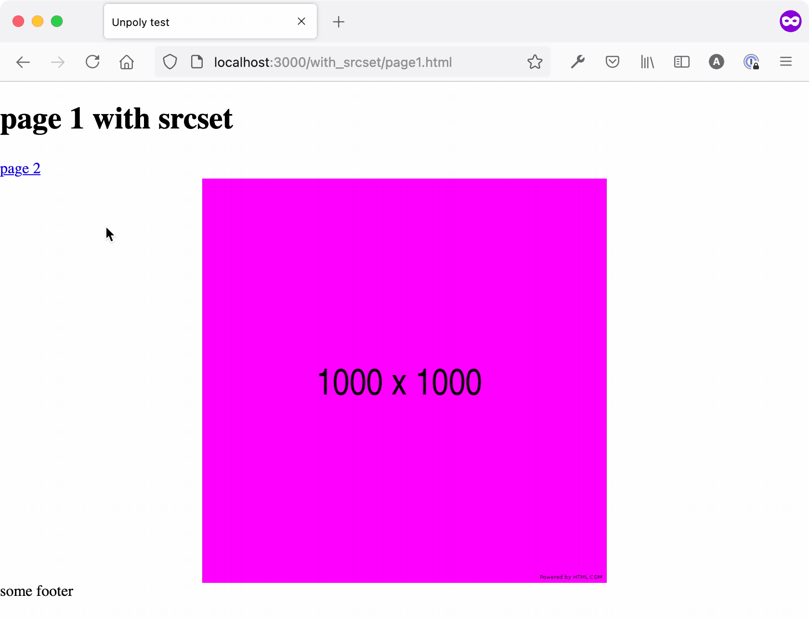
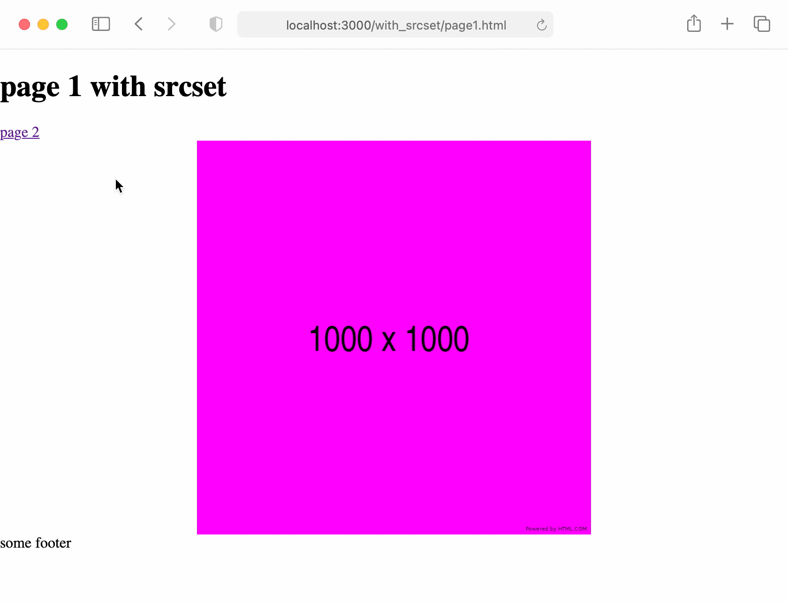

# Images inserted via Unpoly do not show up in Safari

This repository is the simplest project necessary to reproduce a bug that happens for images inserted via Unpoly in Safari.

This only happens to images with a `srcset` attribute. Images without a `srcset` attribute are not affected.

When navigating with Unpoly (e.g. using links with the attribute `up-dash="body"`), images with a `srcset` attribute do not show up at all in macOS Safari.

## Expected behavior (Firefox)

I can click Unpoly links that lead to pages with images and the images are always visible.



## Actual behavior (Safari)

When I click Unpoly links that lead to pages with images, the images do not load. I have to reload the page to see the images.



## Workaround

This problem can be "fixed" by resetting the image's attribute, for example:

```js
up.compiler('img', function (el) {
  const srcset = el.getAttribute('srcset')
  el.setAttribute('srcset', srcset)
})
```

## Setup

You will need a web server that can serve static files from this directory. 

For example `adsf` (A Dead Simple Fileserver) which is a Ruby gem. I can be installed and started with:

```
$ gem install adsf
$ gem install puma
$ adsf -p 5555
```

Visit `localhost:5555/with_srcset/page1.html` to see the bug in action.
